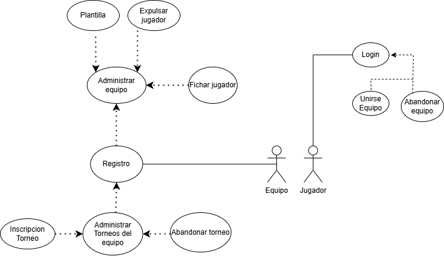
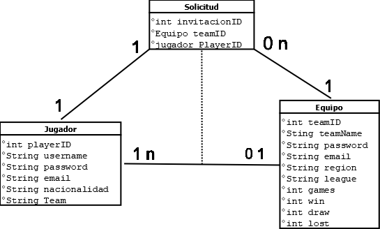

# AD-3.-Tarea-UML

# Sistema de Gestión de Torneos de eSports

## Autor  
**Ignacio Martínez Ortega**  
[Perfil de GitHub](https://github.com/NachoMartinezOrtega)

---

## Descripción del Proyecto

Este proyecto tiene como objetivo crear un sistema que permita gestionar torneos de eSports de manera sencilla y eficiente.  
A través del modelado con diagramas UML, se representan las funcionalidades principales como la gestión de equipos, la administración de torneos y el registro de jugadores.  
Se pretende facilitar la organización de competiciones para que los jugadores puedan disfrutar rápidamente de la experiencia sin complicaciones.

> **Repositorio del proyecto:** [torneo-esports-uml
](https://github.com/NachoMartinezOrtega/AD-3.-Tarea-UML)

---

## Análisis del Problema y Requisitos

Antes de diseñar el sistema, se analizaron las principales necesidades para un torneo de eSports:

### Actores principales:
- **Jugador:** Puede registrarse, formar parte de un equipo, unirse o abandonar equipos y participar en torneos.
- **Equipo:** Gestiona su plantilla de jugadores, inscribe el equipo en torneos y administra su participación.
- **Administrador:** Supervisa el correcto funcionamiento del sistema, valida los resultados y controla el desarrollo de los torneos.

### Funcionalidades principales:
- Registro de nuevos equipos.
- Fichaje y expulsión de jugadores.
- Inscripción y abandono de torneos.
- Acciones básicas como iniciar sesión, unirse a un equipo o gestionar la plantilla.

---

## Diagramas UML

### Diagrama de Casos de Uso

En el siguiente diagrama se muestran las acciones principales de los actores del sistema y cómo interactúan:

---

### Diagrama de Clases

El siguiente diagrama representa la estructura básica de las clases, sus atributos y las relaciones entre ellas:

---

## Identificación de Clases y Relaciones

Se definieron las siguientes clases principales:

- **Jugador:** Representa a los participantes del torneo. Cada jugador puede formar parte de un único equipo.
- **Equipo:** Agrupa varios jugadores bajo una misma entidad competitiva. Un equipo puede tener uno o más jugadores.
- **Solicitud:** Representa la invitación que un equipo envía a un jugador para unirse. Controla las peticiones y mantiene la integridad de las relaciones entre jugadores y equipos.

Las relaciones entre clases son:

- Un **Equipo** puede tener **varios jugadores** (1..n).
- Un **Jugador** puede pertenecer a **un solo equipo** o no estar en ninguno (0..1).
- Un **Equipo** puede enviar múltiples **solicitudes** a diferentes jugadores.

---

## Justificación del Diseño

El diseño se enfocó en mantener la estructura lo más sencilla y limpia posible, reflejando las interacciones principales que se producen en una competición de eSports.

- Separar **Jugador** y **Equipo** permite gestionar fácilmente acciones como unirse o abandonar un equipo.
- Crear una clase **Solicitud** facilita controlar que un jugador no pueda pertenecer a varios equipos al mismo tiempo, evitando conflictos y manteniendo la lógica del sistema consistente.
- El uso de cardinalidades específicas asegura que se respeten las reglas de pertenencia a equipos y de solicitudes.
- Se optó por un diseño modular para facilitar futuras ampliaciones, como añadir torneos más complejos o estadísticas de jugadores.

---

## Conclusión

Trabajar en este proyecto me ha permitido entender mucho mejor la importancia de planificar antes de programar.  
Gracias al uso de los diagramas UML, fue más sencillo visualizar cómo debía organizarse el sistema y cómo debían interactuar las diferentes partes.

Además, pude ver de primera mano lo importante que es diseñar relaciones correctas entre las clases para evitar futuros problemas de inconsistencia.  
Sin duda, esta práctica me motiva a seguir profundizando en el diseño de software y a mejorar mis habilidades de modelado y programación orientada a objetos.
